<h1 align="Center"> BHASHA - a language learning app</h1>

## Table of Content

* [Init](#init)
* [Modules](#modules)
* [Provide Input and translate ](#input)
    + [Input file](#ipfile)
    + [Translate](#trans)
* [MCQ - Quiz](#mcq)
* [Spoken words](#audio)
* [Pronunciation check](#pronounce)
* [ToDos](#todo)
* [Contributions](#contributions)

## <a name="init"></a> Init

There are following 6 items, those needs to be considered

* <b> install Python and related modules </b> : pip install  <b> requirements.txt </b>
* provide input files : here user creates list of words (for exercises) and dumps the file in <b>input</b> folder
* <b> prepare translated words for input words </b>: using GOOGLE googletrans package, translated words are prepared in selected source languages
* <b> prepare MCQ Quiz web pages </b>: here Multiple Choice questions contain question word in Source Language and options in Destination Languages. Also in order to improve memorization, MCQ web pages are also prepared with Question word in Destination language and options in Source Language. There is complete randomization on options.
* <b> prepare audio files </b>: using GOOGLE gTTS (google text to speech) for any  Language word, we can create spoken form of the word from native speaker. This helps our learners to listen carefully the words in native form
* <b> validate proper pronunciation of words </b>: using Speech Recognition module, learner's pronuncation of words can be validated against the given words. The application currently uses speech captured by microphone only.

## <a name="modules"></a> Modules

Bhasha is series of python scripts employed for users to help with language learning. 
We have used HTML/JS based frontend, and GOOGLE SDK for preparing language content. 


Please use python version 3.9 or above

and install following Python modules :

```shell
$ pip install -r requirments.txt
googletrans        4.0.0rc1
gTTS               2.2.4
PyAudio            0.2.12
SpeechRecognition  3.8.1
```
Following scripts are prepared and are to be run alphabetically (please check prefixes)

* app\a_prepare_translation.py
* app\b_prepare_questions.py
* app\c_prepare_audio.py


## <a name="input"></a> Provide Input and Translate

### <a name="ipfile"></a> Input File<br />

First prepare a list of difficult words that you want to learn in Source language. Store these words in a file with distinct name and place it inside the folder <b>input</b>.

Please ensure the words are correctly spelled and with no syntax errors. These words get later translated via googletrans package

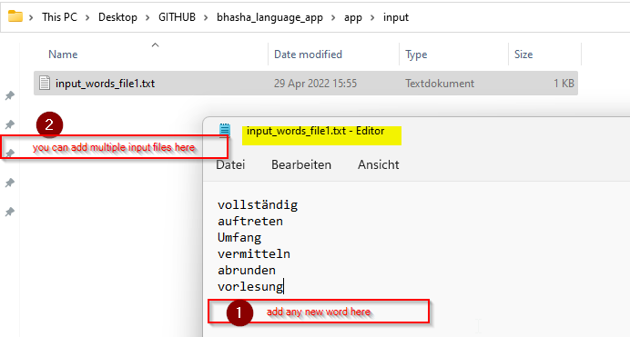

### <a name="trans"></a> Translate <br />

If you want to change Source language / Destination language, please consider setting them in script <i><b>app\a_prepare_translation.py</i></b>. Only [GOOGLE supported languages](https://cloud.google.com/translate/docs/languages) are configurable.

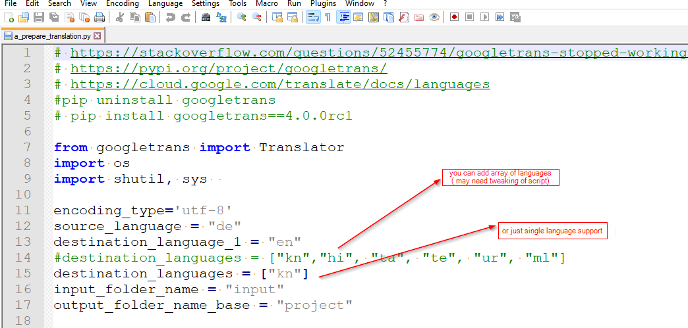

Now execute the script to prepare translation of all words and files from <b>input</b> folder

```shell
$ python a_prepare_translation.py
```

The resulting translations from GOOGLE will be placed under newly created <b>project</b> folder. This folder is like input for rest of the scripts, as it contains already translations.

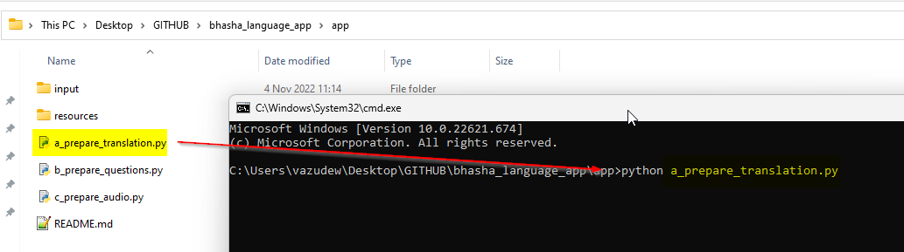
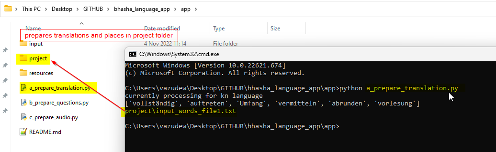


<b>Please note </b> one can select multiple Destination languages, but only 1 Source language.

## <a name="mcq"></a> MCQ - QUIZ

Multiple Choice Question is a Quiz web application, containing a question word and multiple choices. 

We have both kind of question types i.e. Question is in Destination Language / Options in Source Language and vice versa. This way, learners can ensure good memorization of words to improve vocabulary.

The oprtions here are completely randomized.

Learner must however define how many such question set she needs, which is by default set to 2. 
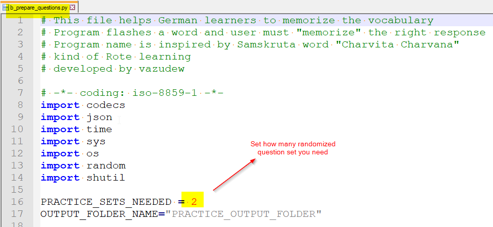

Then execute second script

```shell
$ python b_prepare_questions.py
```
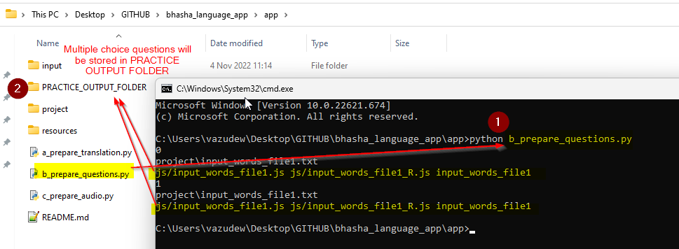

 The question sets will be created from contents of <b>project</b> folder and resulting web pages are stored into <b>PRACTICE_OUTPUT_FOLDER</b>. Please check following illustrations

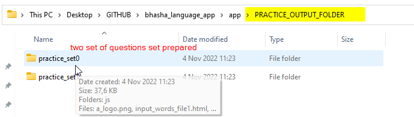
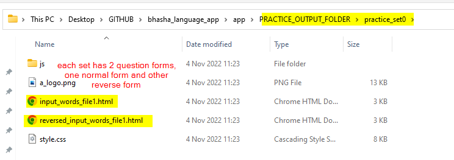

From Question Set folders, look for html pages with input file names, and reversed (destination/source language). 

One can activate quiz game, by opening these files in favorite browser.

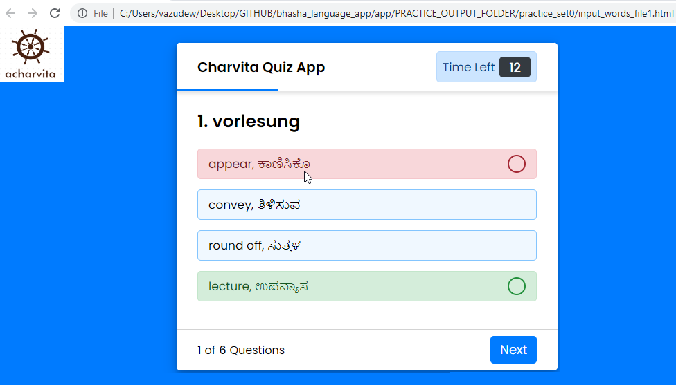
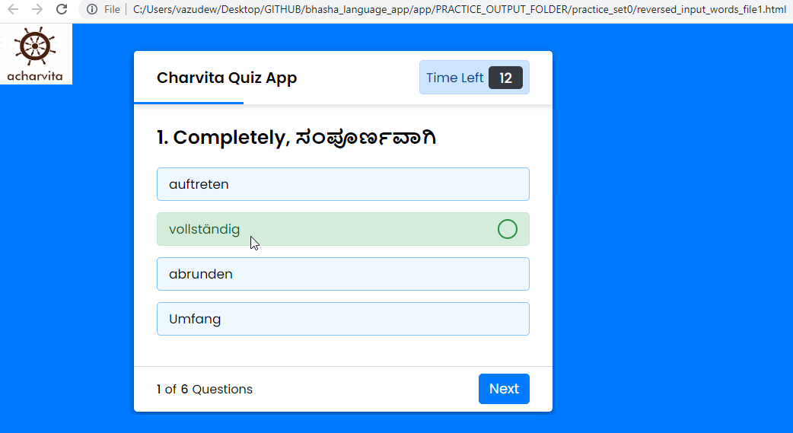

After each game, a score will be displayed for developing confidence with memorization of words
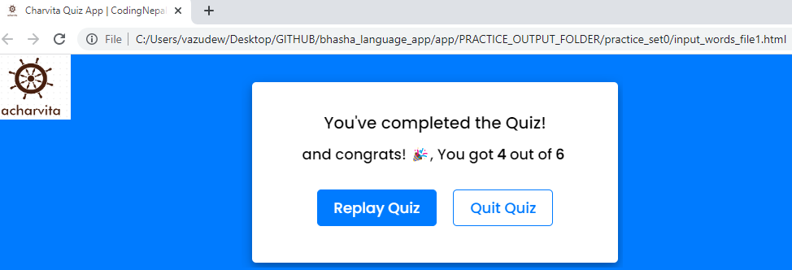

## <a name="audio"></a> Spoken words audio

It is also essential for learners to hear and understand those words in native spoken form.

gTTS module helps preparation of these audio files, preparing users for listening practices.

We execute third script 

```shell
$ python c_prepare_audio.py
```
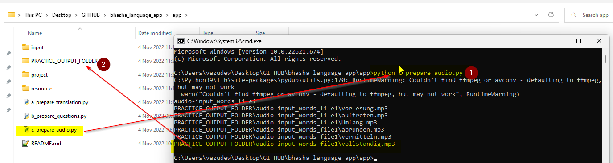

All audio files will be created under folder  <b>PRACTICE_OUTPUT_FOLDER</b> with relevant file structure. Then learners can use their favorite media player to listen to these words and continue memorizing practice.

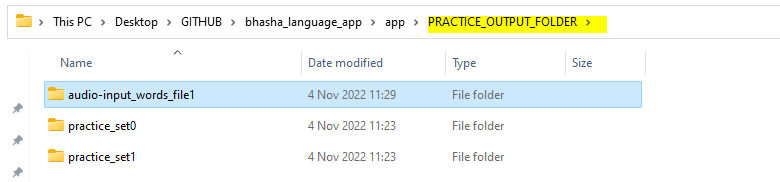
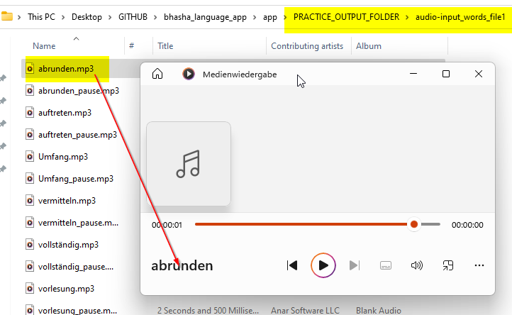

## <a name="pronounce"></a> Pronunciation check

In this section, Bhasha prompts learner to pronounce a random word from the list via microphone. The captured word will be compared against the given word using speech recognition. The scoring will be done accordingly.

```shell
$ python d_prepare_speech.py
```
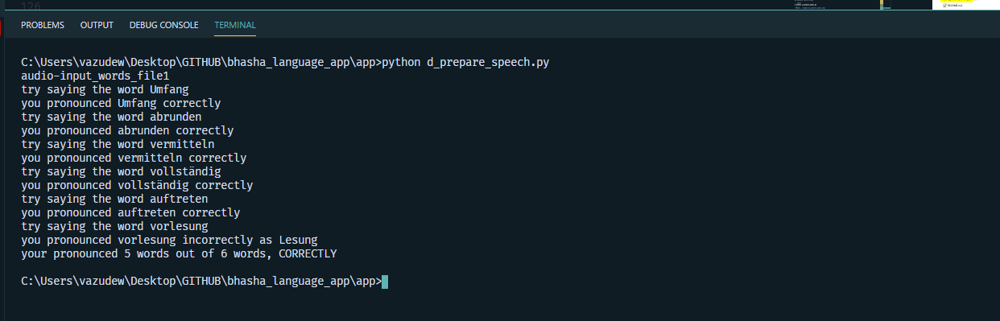


## <a name="todo"></a> ToDos
* custom selection of languages
* migrate to cloud 
* database of words list
* end-to-end frontend 
* joining of audio files for exercise
* reading game (fill in the blanks)


## <a name="contribution"></a> Contributions
1 Concept, Design & Development, and Presentation [Vasudeva Nayak Kukkundoor](https://www.linkedin.com/in/vasudeva-nayak-kukkundoor-04183816/) 

2 Devlopment, and Testing [Ajeya Nayak](https://www.linkedin.com/in/ajeya-nayak-34801766/)

3 Frontend design and code [CodingNepal](https://dev.to/codingnepal/create-a-quiz-app-with-timer-using-html-css-javascript-55lf)